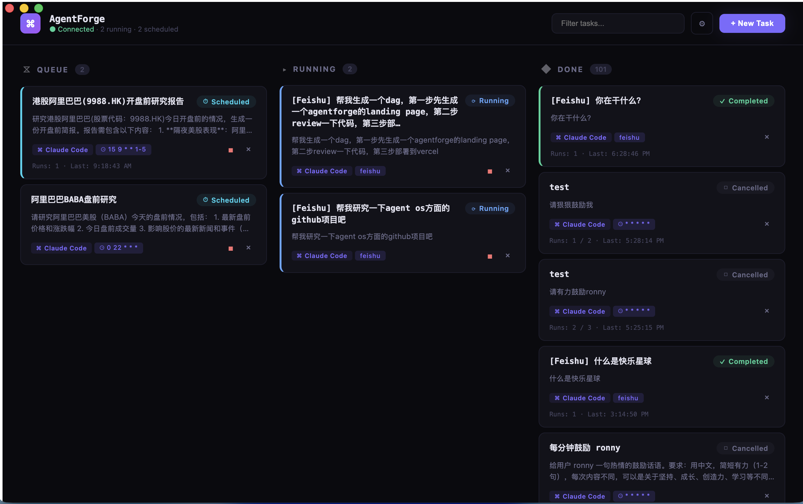

# AgentForge

> Orchestrate AI coding agents from your Mac — schedule, monitor, and chain Claude Code tasks on a kanban board.

[](LICENSE)
[](https://github.com/releases)
[](https://python.org)
[](https://docs.anthropic.com/en/docs/claude-code)

**Website**: https://agentforge-landing-weld.vercel.app/



---

## Table of Contents

- [Features](#features)
- [Requirements](#requirements)
- [Installation](#installation)
- [Troubleshooting](#troubleshooting)
- [Quick Start](#quick-start)
- [Chat Channels](#chat-channels)
- [Multi-Agent Pipelines (DAG)](#multi-agent-pipelines-dag)
- [API Reference](#api-reference)
- [Background Service](#background-service)
- [Architecture](#architecture)
- [Contributing](#contributing)
- [License](#license)

---

## Features

- **Agents that spawn agents** — Any running task can create sub-tasks, build DAG pipelines, and collect results via the bundled Claude Code skill
- **Kanban Task Board** — Visual Queue / Running / Done columns with live output streaming
- **DAG Pipelines** — Define task dependencies with automatic cascade execution and failure propagation
- **Flexible Scheduling** — Immediate, delayed, one-time datetime, and cron-based recurring tasks
- **Dual Agent Backends** — Run tasks with Claude Code CLI or OpenAI Codex CLI; choose per-task or set a default
- **Chat Control** — Create tasks and receive notifications from Telegram, Slack, Feishu/Lark, or WeChat
- **Persistent Storage** — SQLite-backed task history, run logs, and streaming output
- **Native macOS App** — Electron shell with one-click DMG install

---

## Requirements

- macOS 12.0+ (Apple Silicon or Intel)
- Python 3.12+
- Node.js 18+
- [Claude Code CLI](https://docs.anthropic.com/en/docs/claude-code) installed and on `PATH` (default agent)
- [OpenAI Codex CLI](https://github.com/openai/codex) on `PATH` — optional, required only if using Codex as agent backend (`npm install -g @openai/codex`)

---

## Installation

### Option 1: Desktop App (Recommended)

1. Download the latest `AgentForge-*.dmg` from the [Releases](../../releases) page.
2. Open the DMG and drag **AgentForge** into `/Applications`.
3. Launch from Launchpad or the Applications folder.

### Option 2: Build from Source

```bash
git clone https://github.com/your-org/agentforge.git
cd agentforge

# Install all dependencies
make install-deps

# Build and package a DMG
make package-dmg
# Output: taskboard-electron/out/make/AgentForge-1.0.0-arm64.dmg
```

### Option 3: Development Mode

```bash
git clone https://github.com/your-org/agentforge.git
cd agentforge

uv sync
cd taskboard-electron && npm install && cd ..

# Terminal 1: start Python backend
uv run taskboard.py

# Terminal 2: start Electron + Vite dev server
cd taskboard-electron && npm start
```

---

## Troubleshooting

### `npm install` hangs or freezes

This is the most common setup issue. The Electron binary (~100 MB) is downloaded from GitHub and may stall on slow connections or in China.

**Quick fix — use mirrors:**

```bash
npm config set registry https://registry.npmmirror.com
export ELECTRON_MIRROR=https://npmmirror.com/mirrors/electron/
cd taskboard-electron && npm install
```

**Full guide:** [docs/installation-troubleshooting.md](docs/installation-troubleshooting.md) covers:
- How to diagnose whether the hang is network or native compilation
- Mirror setup for China and slow connections
- Installing build tools (macOS / Linux / Windows)
- Node.js version requirements
- Full clean-install procedure

---

## Quick Start

Once the app is running, the backend listens on `http://127.0.0.1:9712`.

**Create a task via the UI:** Open AgentForge, click **New Task**, fill in the title, prompt, and working directory, choose a schedule type, and click **Create**.

**Create a task via curl:**

```bash
# Run immediately (uses default agent — claude)
curl -X POST http://localhost:9712/api/tasks \
  -H "Content-Type: application/json" \
  -d '{
    "title": "Code review",
    "prompt": "Review the code changes in this directory",
    "working_dir": "~/projects/myapp",
    "schedule_type": "immediate"
  }'

# Run after a delay (seconds)
curl -X POST http://localhost:9712/api/tasks \
  -H "Content-Type: application/json" \
  -d '{
    "title": "Delayed review",
    "prompt": "Review recent commits",
    "working_dir": "~/projects/myapp",
    "schedule_type": "delayed",
    "delay_seconds": 300
  }'

# Recurring cron schedule (daily at 9 AM)
curl -X POST http://localhost:9712/api/tasks \
  -H "Content-Type: application/json" \
  -d '{
    "title": "Daily digest",
    "prompt": "Summarize TODO comments across the codebase",
    "working_dir": "~/projects/myapp",
    "schedule_type": "cron",
    "cron_expr": "0 9 * * *",
    "max_runs": 30
  }'

# Use Codex CLI instead of Claude Code
curl -X POST http://localhost:9712/api/tasks \
  -H "Content-Type: application/json" \
  -d '{
    "title": "Refactor auth module",
    "prompt": "Refactor the authentication module for clarity",
    "working_dir": "~/projects/myapp",
    "schedule_type": "immediate",
    "agent": "codex"
  }'
```

To set Codex as the default agent for all tasks:

```bash
curl -X PUT http://localhost:9712/api/settings \
  -H "Content-Type: application/json" \
  -d '{"default_agent": "codex"}'
```

---

## Chat Channels

Control AgentForge from your favorite messaging app. Channels auto-start when the corresponding environment variables are detected.

| Channel | Transport | Difficulty |
|---------|-----------|------------|
| Telegram | Bot API (polling) | Easy |
| Slack | Socket Mode | Moderate |
| Feishu / Lark | WebSocket long-connection | Moderate |
| WeChat | Node bridge (experimental) | Moderate |

<details>
<summary><b>Telegram setup</b></summary>

### 1. Create a Bot

1. Chat with [@BotFather](https://t.me/BotFather) on Telegram.
2. Send `/newbot` and follow the prompts.
3. Copy the **HTTP API token**.

### 2. Configure

```bash
export TELEGRAM_BOT_TOKEN="123456789:ABCdefGHIjklMNOpqrSTUvwxYZ"
export TELEGRAM_ALLOWED_USERS="123456789"   # optional — restrict access by user ID
```

### 3. Commands

| Command | Description |
|---------|-------------|
| `/newtask <title> \| <prompt>` | Create a task |
| `/list` | List all tasks |
| `/status <id>` | Task details |
| `/cancel <id>` | Cancel a task |
| `/help` | Show help |

</details>

<details>
<summary><b>Slack setup</b></summary>

### 1. Create a Slack App

Go to [api.slack.com/apps](https://api.slack.com/apps) → **Create New App → From scratch**.

### 2. Bot Permissions

Under **OAuth & Permissions → Bot Token Scopes**, add:
`app_mentions:read`, `chat:write`, `im:history`, `im:read`, `im:write`, `reactions:write`

### 3. Enable Socket Mode

**Socket Mode** → toggle on → generate an **App-Level Token** (`xapp-…`) with `connections:write`.

### 4. Subscribe to Events

**Event Subscriptions → Subscribe to bot events**: `app_mention`, `message.im`

### 5. Configure

```bash
export SLACK_BOT_TOKEN="xoxb-..."
export SLACK_APP_TOKEN="xapp-..."
export SLACK_ALLOWED_USERS="U012AB3CD"   # optional
```

### 6. Commands

Send as a DM or @mention:

| Command | Description |
|---------|-------------|
| `newtask <title> \| <prompt>` | Create a task |
| `list` | List all tasks |
| `status <id>` | Task details |
| `cancel <id>` | Cancel a task |

</details>

<details>
<summary><b>Feishu / Lark setup</b></summary>

Feishu uses the settings API (no environment variables needed). It connects via WebSocket — no public IP required.

### 1. Create a Feishu App

- [Feishu Open Platform](https://open.feishu.cn/app) → new app → enable **Bot**
- Permissions: `im:message`, `im:resource`
- Events: `im.message.receive_v1` with **Long Connection** mode
- Copy **App ID** and **App Secret**

### 2. Configure via API

```bash
curl -X POST http://127.0.0.1:9712/api/feishu/settings \
  -H "Content-Type: application/json" \
  -d '{
    "feishu_app_id": "cli_xxxx",
    "feishu_app_secret": "your_app_secret",
    "feishu_default_working_dir": "~/projects",
    "feishu_enabled": "true"
  }'
```

Or configure from the desktop app's settings page.

</details>

<details>
<summary><b>WeChat setup (experimental)</b></summary>

WeChat uses a Node.js sidecar bridge — no environment variables needed. Configure and enable it via the API or the desktop app's settings page.

### 1. Enable via API

```bash
curl -X POST http://127.0.0.1:9712/api/channels/settings \
  -H "Content-Type: application/json" \
  -d '{
    "weixin_enabled": "true",
    "weixin_default_working_dir": "~/projects",
    "weixin_base_url": "https://ilinkai.weixin.qq.com",
    "weixin_account_id": ""
  }'
```

### 2. Scan the QR code

On first launch the bridge will request a QR code login. Scan it with your WeChat mobile app to authenticate. The session is saved for subsequent restarts.

### Notes

- Text-only MVP — rich media is not supported.
- The bridge uses the `getupdates` / `sendmessage` HTTP protocol.
- Single-account per AgentForge instance.

</details>

> See [`channels/README.md`](channels/README.md) for detailed setup, notification behavior, and adding custom channels.

---

## Multi-Agent Pipelines (DAG)

AgentForge ships with a **Claude Code skill** (`skills/agentforge/`) that lets any agent running inside Claude Code create and manage other AgentForge tasks — enabling recursive, multi-agent workflows.

```
          User
           |
           v
     [ Task A ]  ──creates──>  [ Task B ]  [ Task C ]
                                    |
                                  creates
                                    v
                               [ Task D ]  (depends on B)
```

### Install the skill

```bash
# Symlink into your Claude Code skills directory
ln -s /path/to/agentforge/skills/agentforge ~/.claude/skills/agentforge
```

### What the skill enables

- **Fan-out / fan-in** — Spawn N sub-tasks in parallel, poll until complete, synthesize results
- **DAG dependencies** — `--depends-on <ids>` makes downstream tasks wait for upstream to finish; failures cascade-cancel the rest
- **Result injection** — `--inject-result` prepends upstream output into the downstream prompt automatically
- **Scheduled sub-workflows** — Combine cron, delayed, and immediate schedules within a pipeline

### Example — parallel research pipeline

```
Research the top 3 competitors of Acme Corp.
For each competitor, create a separate AgentForge task that:
  1. Gathers recent news and financials
  2. Writes a one-page summary
Then create a final task (depends-on the above 3) that
synthesizes everything into a comparative report.
```

AgentForge handles scheduling, dependency tracking, and result passing automatically.

---

## API Reference

All endpoints are served at `http://127.0.0.1:9712/api`.

| Method | Endpoint | Description |
|--------|----------|-------------|
| GET | `/api/tasks` | List all tasks |
| GET | `/api/tasks/:id` | Get a single task |
| POST | `/api/tasks` | Create a task |
| POST | `/api/tasks/:id/cancel` | Cancel a task |
| POST | `/api/tasks/:id/retry` | Retry a failed task |
| DELETE | `/api/tasks/:id` | Delete a task |
| GET | `/api/tasks/:id/runs` | Get run history |
| GET | `/api/tasks/:id/output` | Get accumulated output |
| GET | `/api/tasks/:id/events` | Get structured output events |
| GET | `/api/health` | Health check |

---

## Background Service

To keep the backend running persistently without the desktop app:

```xml
<!-- ~/Library/LaunchAgents/com.agentforge.taskboard.plist -->
<?xml version="1.0" encoding="UTF-8"?>
<!DOCTYPE plist PUBLIC "-//Apple//DTD PLIST 1.0//EN"
  "http://www.apple.com/DTDs/PropertyList-1.0.dtd">
<plist version="1.0">
<dict>
    <key>Label</key>
    <string>com.agentforge.taskboard</string>
    <key>ProgramArguments</key>
    <array>
        <string>/usr/local/bin/uv</string>
        <string>run</string>
        <string>/path/to/agentforge/taskboard.py</string>
    </array>
    <key>WorkingDirectory</key>
    <string>/path/to/agentforge</string>
    <key>RunAtLoad</key>
    <true/>
    <key>KeepAlive</key>
    <true/>
    <key>StandardOutPath</key>
    <string>/tmp/agentforge.log</string>
    <key>StandardErrorPath</key>
    <string>/tmp/agentforge.err</string>
</dict>
</plist>
```

```bash
launchctl load ~/Library/LaunchAgents/com.agentforge.taskboard.plist
```

---

## Architecture

```
┌──────────────────┐     HTTP/JSON      ┌──────────────────┐
│   React Frontend │ <────────────────> │  Python Backend  │
│   (Kanban UI)    │   localhost:9712   │  (Scheduler+API) │
└──────────────────┘                   └───────┬──────────┘
                                               |
                               ┌───────────────┼───────────────┐
                               v               v               v
                         [ SQLite DB ]   [ Scheduler ]   [ Claude CLI ]
```

- **Python backend** (`taskboard.py`) — single-file `BaseHTTPRequestHandler` server. Manages tasks in SQLite (`~/.agentforge/tasks.db`), runs `claude` or `codex` CLI via `AgentExecutor`, and schedules work with `TaskScheduler` (polls every 2 s, supports cron via `croniter`).
- **Electron shell** (`taskboard-electron/`) — spawns the Python backend on start, kills it on quit. Loads React renderer from Vite dev server (dev) or bundled assets (prod).
- **React frontend** (`App.jsx`) — single-component kanban board that polls the REST API and renders colorized streaming output.

---

## Contributing

Contributions are welcome! Here's how to get started:

1. Fork the repository and create a feature branch.
2. Start the app in development mode (see [Option 3](#option-3-development-mode) above).
3. Make your changes and verify them manually — there are no automated tests.
4. Open a pull request with a clear description of the change.

**Key files:**
- `taskboard.py` — entire Python backend (DB, scheduler, executor, HTTP handlers)
- `taskboard-electron/src/main.js` — Electron main process
- `taskboard-electron/src/renderer/App.jsx` — React frontend (~1500 lines)
- `channels/` — pluggable chat channel adapters (Telegram, Slack, Feishu, WeChat)
- `skills/agentforge/` — Claude Code skill for agent-to-agent delegation

---

## License

MIT — see [LICENSE](LICENSE) for details.
