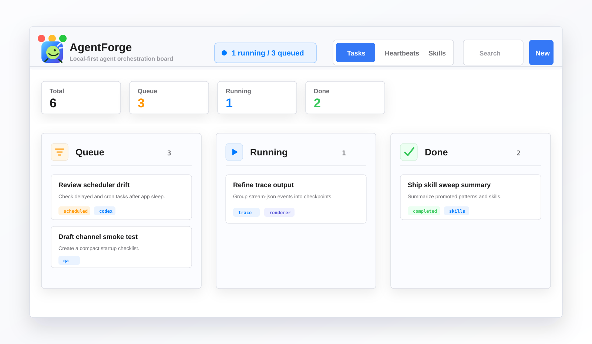

# AgentForge

**一个本地优先的 macOS 智能体工作台，用看板方式调度、观察和复用 Claude Code / OpenAI Codex CLI 任务。**

[](LICENSE)
[](../../releases)
[](https://bun.sh)
[](https://www.typescriptlang.org)

AgentForge 把 AI 编程智能体变成可见、可排队、可调度的本地工作流。你可以创建任务、查看实时输出、设置周期检查、从聊天工具触发任务，并把重复工作沉淀成可复用技能。

**官网:** https://agentforge-landing-weld.vercel.app/



## 为什么用 AgentForge

- **不用盯着终端等结果。** 把任务放进队列，从 Queue / Running / Done 看板里查看状态。
- **每个任务选择合适智能体。** 任务级支持 Claude Code 或 Codex CLI，也可以设置默认智能体。
- **把重复工作产品化。** 支持立即、延迟、定时和 cron 调度，成功模式还可以进入 Skill Library。
- **执行留在本机。** 后端只监听 `127.0.0.1`，状态存进 SQLite，智能体 CLI 在你的 Mac 上运行。

## 快速开始

### 安装桌面 App

1. 从 [Releases](../../releases) 下载最新 `AgentForge-*.dmg`。
2. 把 **AgentForge** 拖进 `/Applications`。
3. 启动 App，选择工作目录，创建第一个任务。

### 从源码运行

```bash
git clone https://github.com/hetaoBackend/agentforge.git
cd agentforge

cd backend
bun install --frozen-lockfile

cd ../taskboard-electron
bun install --frozen-lockfile
bun run start
```

需要分别安装 `backend/` 和 `taskboard-electron/` 的依赖：Electrobun 宿主进程会直接 import 后端源码，所以即使启动的是桌面 App，后端 package 依赖也必须存在。开发命令会构建 Electrobun/React 前端，在桌面宿主进程中启动 Bun 后端，并在改动后重新启动 App。

### 构建 DMG

```bash
cd taskboard-electron
bun run make
```

稳定版 macOS DMG 产物位于 `taskboard-electron/build/stable-macos-arm64/`。

## 核心能力

| 模块 | 作用 |
| --- | --- |
| **Tasks** | Pending、scheduled、blocked、running、completed、failed、cancelled 任务看板。 |
| **Scheduling** | 支持 immediate、delayed、`scheduled_at`、cron 和最大运行次数。 |
| **Live output** | 持久化 Claude Code / Codex CLI 的结构化流式输出。 |
| **Heartbeats** | 周期检查，可以决定 trigger、resume 或 notify。 |
| **Skill Library** | 从完成任务中发现模式，生成可编辑 `SKILL.md`，再安装到智能体技能目录。 |
| **Chat channels** | Telegram、Slack、飞书/Lark、微信渠道可创建或跟踪任务。 |
| **DAG pipelines** | 支持任务依赖、失败传播和上游结果注入。 |

## 环境要求

- macOS 12+
- [Bun](https://bun.sh) 1.3+，并且在 `PATH` 中可找到 (`command -v bun`)
- [Claude Code CLI](https://docs.anthropic.com/en/docs/claude-code) 或 [OpenAI Codex CLI](https://github.com/openai/codex) 在 `PATH` 中

## Skill Library

Skill Library 会把你反复做的工作沉淀成智能体可复用技能。

1. **Detect**: 从已完成任务中发现重复 recipe 和常见 pitfall。
2. **Distill**: 把值得复用的模式蒸馏成标准 `SKILL.md` 草稿。
3. **Approve**: 你先审核和编辑草稿，再决定是否安装。
4. **Deliver**: 批准后的技能写入 `~/.agentforge/skills`，并 symlink 到 `~/.claude/skills` 与 `~/.agents/skills`。

自动 sweep 默认关闭，因为它会消耗 token。你可以在 Settings 里开启，也可以在 Skills tab 手动扫描。

## 架构

```text
┌─────────────────────┐        HTTP/JSON        ┌─────────────────────┐
│ Electrobun + React  │  <--------------------> │ Bun TypeScript API  │
│ Task board renderer │      127.0.0.1:9712     │ Scheduler + runner  │
└─────────────────────┘                         └──────────┬──────────┘
                                                            │
                                      ┌─────────────────────┼─────────────────────┐
                                      │                     │                     │
                                  SQLite              TaskScheduler         AgentExecutor
                              ~/.agentforge           cron + delayed       claude / codex
```

- `taskboard-electron/src/electrobun/main.ts` 随桌面 App 启停后端。
- `taskboard-electron/src/renderer/App.tsx` 渲染任务看板、心跳、设置和技能库。
- `backend/taskboard.ts` 通过 `Bun.serve` 暴露 REST API。
- `backend/src/db.ts` 用 SQLite 存储任务、运行记录、输出事件、设置、心跳和技能。
- `backend/src/executor.ts` 运行 Claude Code 或 Codex CLI，并持久化流式输出。
- `backend/src/scheduler.ts` 轮询 due tasks，并处理调度、心跳和技能扫描。

## API 示例

所有 API 都在 `http://127.0.0.1:9712/api` 下。

```bash
curl -X POST http://127.0.0.1:9712/api/tasks \
  -H "Content-Type: application/json" \
  -d '{
    "title": "Review auth changes",
    "prompt": "Review the latest auth module diff for regressions and missing tests.",
    "working_dir": "~/projects/myapp",
    "schedule_type": "immediate",
    "agent": "codex"
  }'
```

常用任务接口:

| Method | Endpoint | Description |
| --- | --- | --- |
| `GET` | `/api/tasks` | 列出任务 |
| `POST` | `/api/tasks` | 创建任务 |
| `GET` | `/api/tasks/:id` | 读取单个任务 |
| `POST` | `/api/tasks/:id/cancel` | 取消任务 |
| `POST` | `/api/tasks/:id/retry` | 重试失败任务 |
| `GET` | `/api/tasks/:id/events` | 读取结构化输出事件 |
| `GET` | `/api/health` | 后端健康检查 |

## 消息渠道

消息渠道是可选能力，用来从常用聊天工具创建任务或接收状态更新。

| 渠道 | 传输方式 | 说明 |
| --- | --- | --- |
| Telegram | Bot API polling | 配置 bot token 即可使用。 |
| Slack | Socket Mode | 使用 bot token 和 app-level token。 |
| 飞书 / Lark | WebSocket long connection | 不需要公网 IP。 |
| 微信 | Local bridge | 实验性文本渠道。 |

渠道适配器位于 `backend/src/channels/`，可以在 App 设置页或 REST API 中配置。

## 多智能体流水线

AgentForge 自带 `skills/agentforge/`，让 Claude Code 中运行的任务可以创建和管理其他 AgentForge 任务。

这可以用于并行研究、结果汇总、依赖卡点、上游结果注入和周期性子工作流。

```text
User
  |
  v
Task A --creates--> Task B
  |                 Task C
  |                   |
  `------depends------v
                   Task D
```

安装内置技能:

```bash
ln -s /path/to/agentforge/skills/agentforge ~/.claude/skills/agentforge
```

## 开发

后端:

```bash
cd backend
bun taskboard.ts
```

桌面 App:

```bash
cd backend
bun install --frozen-lockfile

cd ../taskboard-electron
bun install --frozen-lockfile
bun run start
```

运行桌面 App 时，不要在同一台机器上另外启动 `backend/taskboard.ts`：Electrobun 宿主进程会在 `127.0.0.1:9712` 上启动内置后端。

质量门禁:

```bash
# Backend CI gate
make check

# Frontend CI gate
cd taskboard-electron
bun run typecheck
bun run lint
bun run format:check
bun run test
bun run build:check
```

## 常见问题

如果 `bun install` 或 `bun run build:check` 下载 Electrobun artifact 时卡住，可以使用 npm 镜像:

```bash
cd taskboard-electron
bun install --registry https://registry.npmmirror.com
```

更多说明见 [docs/installation-troubleshooting.md](docs/installation-troubleshooting.md)。

## 参与贡献

1. Fork 仓库并创建功能分支。
2. 使用 `cd taskboard-electron && bun run start` 启动开发模式。
3. 保持改动聚焦，提交 PR 前运行相关质量门禁。

关键文件:

- `backend/` - Bun/TypeScript 后端、调度器、执行器、API 和渠道。
- `taskboard-electron/src/electrobun/main.ts` - Electrobun Bun 主进程。
- `taskboard-electron/src/renderer/App.tsx` - React 渲染进程。
- `skills/agentforge/` - 智能体委派任务的内置技能。

## 许可证

MIT - 详见 [LICENSE](LICENSE)。
