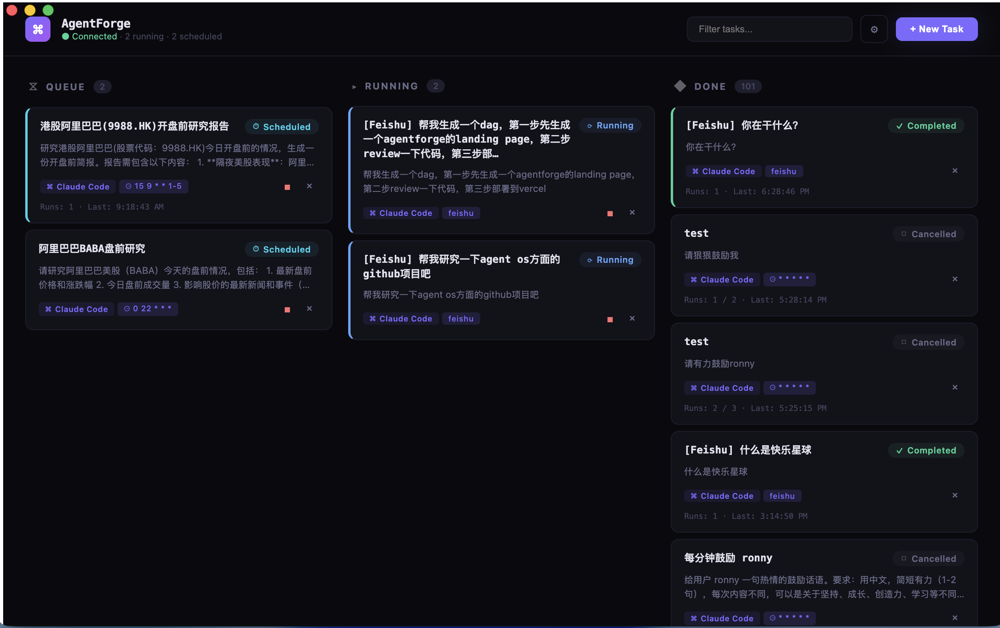

# AgentForge

> 在 Mac 上编排 AI 编程智能体 —— 通过看板界面调度、监控和串联 Claude Code 任务。

[](LICENSE)
[](https://github.com/releases)
[](https://bun.sh) [](https://www.typescriptlang.org)
[](https://docs.anthropic.com/en/docs/claude-code)

**官网**: https://agentforge-landing-weld.vercel.app/



---

## 目录

- [功能特性](#功能特性)
- [技能库（Skill Library）](#技能库skill-library)
- [环境要求](#环境要求)
- [安装](#安装)
- [常见问题](#常见问题)
- [快速开始](#快速开始)
- [消息频道](#消息频道)
- [多智能体流水线（DAG）](#多智能体流水线dag)
- [API 参考](#api-参考)
- [后台服务](#后台服务)
- [架构说明](#架构说明)
- [参与贡献](#参与贡献)
- [许可证](#许可证)

---

## 功能特性

- **🧬 自复利技能库（Skill Library）** —— AgentForge 自动发现你反复跑的任务模式，借助 Anthropic [skill-creator](https://github.com/anthropics/skills/tree/main/skills/skill-creator) 蒸馏成可复用的 Claude Code Skill。审核、批准后自动 symlink 进 Claude Code 与 Codex —— 用得越多，agent 越懂你的活。[了解更多 →](#技能库skill-library)
- **智能体生成智能体** —— 任何运行中的任务都可通过内置的 Claude Code Skill 创建子任务、构建 DAG 流水线并汇总结果
- **看板任务视图** —— 可视化的「待执行 / 运行中 / 已完成」三列布局，支持实时输出流
- **DAG 流水线** —— 定义任务依赖关系，支持自动级联执行和失败传播
- **灵活调度** —— 即刻执行、延迟执行、指定时间一次性执行、cron 周期任务
- **消息频道控制** —— 通过 Telegram、Slack 或飞书/Lark 创建任务并接收完成通知
- **持久化存储** —— SQLite 存储任务历史、运行记录和流式输出
- **原生 macOS 应用** —— Electron 封装，一键 DMG 安装

---

## 技能库（Skill Library）

**把你反复做的活，自动沉淀成 agent 可复用的技能。** 用得越多，AgentForge 越懂你的工作流。

1. **检测** —— 后台定时扫描（或手动点「扫一遍」）分析你已完成的任务，把跨任务复发的模式记进账本：既包括*成功配方*（你反复跑的工作流），也包括*避坑*（你诊断并修好的失败）。按 run 幂等计数，重复扫描不会灌水。
2. **蒸馏** —— 对值得固化的模式，AgentForge 用 Anthropic 的 **[skill-creator](https://github.com/anthropics/skills/tree/main/skills/skill-creator)** 技能起草规范的 `SKILL.md` —— 而且会**先判断到底值不值得**做成 skill，免得噪声泛滥。
3. **审批** —— 审阅草稿：价值判定、贡献的任务、以及完全可编辑的 `SKILL.md`，批准或驳回，决定权在你。
4. **投递** —— 批准后写一份 canonical 文件，并 symlink 进 **Claude Code**（`~/.claude/skills`）和 **Codex**（`~/.agents/skills`）两个原生目录，两个 agent 都按渐进式披露原生加载 —— 零 prompt 注入。
5. **管理** —— 在 **Skills** 标签里逐个启用/停用（增删 symlink，保留文件）、查看 `SKILL.md`、或删除。

> 自动每日扫描**默认关闭**（会消耗 token）。在 **设置 → Skill Library** 里打开、选 agent 和节奏，或随时点手动「扫一遍」—— 手动按钮不受阈值限制，永远可用。

蒸馏出的都是标准 Claude Code `SKILL.md` 文件（canonical 存于 `~/.agentforge/skills`，symlink 到各 agent 原生目录）—— 可移植、可检视、零锁定。

---

## 环境要求

- macOS 12.0+（Apple Silicon 或 Intel）
- [Bun](https://bun.sh) 1.3+
- [Claude Code CLI](https://docs.anthropic.com/en/docs/claude-code)（已安装并在 `PATH` 中）

---

## 安装

### 方式一：桌面应用（推荐）

1. 从 [Releases](../../releases) 页面下载最新的 `AgentForge-*.dmg`。
2. 打开 DMG，将 **AgentForge** 拖入 `/Applications`。
3. 从启动台或应用程序文件夹打开。

### 方式二：从源码构建

```bash
git clone https://github.com/your-org/agentforge.git
cd agentforge

# 安装全部依赖
make install-deps

# 构建并打包 DMG
make package-dmg
# 输出路径：taskboard-electron/out/make/AgentForge-1.0.0-arm64.dmg
```

### 方式三：开发模式

```bash
git clone https://github.com/your-org/agentforge.git
cd agentforge

make install-deps  # bun install in backend/ and taskboard-electron/

# 启动 Electron + 后端（Bun 负责构建、监听并自动拉起后端）
cd taskboard-electron && bun run start
```

---

## 常见问题

### `bun install` 卡住不动

这是最常见的安装问题。Electron 二进制包约 100MB，从 GitHub 下载，在国内网络环境下极易卡住。

**快速解决——使用国内镜像：**

```bash
export ELECTRON_MIRROR=https://npmmirror.com/mirrors/electron/
cd taskboard-electron && bun install --registry https://registry.npmmirror.com
```

**完整排查指南：** [docs/installation-troubleshooting.md](docs/installation-troubleshooting.md)，涵盖：
- 如何判断是网络卡住还是编译卡住
- 国内镜像及永久配置方法
- macOS / Linux / Windows 编译工具安装
- Node.js 版本要求
- 完整清理重装流程

---

## 快速开始

应用启动后，后端监听在 `http://127.0.0.1:9712`。

**通过 UI 创建任务：** 打开 AgentForge，点击 **New Task**，填写标题、提示词和工作目录，选择调度类型后点击 **Create**。

**通过命令行创建任务：**

```bash
# 立即执行
curl -X POST http://localhost:9712/api/tasks \
  -H "Content-Type: application/json" \
  -d '{
    "title": "代码审查",
    "prompt": "审查当前目录的代码变更",
    "working_dir": "~/projects/myapp",
    "schedule_type": "immediate"
  }'

# 延迟执行（300 秒后）
curl -X POST http://localhost:9712/api/tasks \
  -H "Content-Type: application/json" \
  -d '{
    "title": "延迟审查",
    "prompt": "审查最近的提交",
    "working_dir": "~/projects/myapp",
    "schedule_type": "delayed",
    "delay_seconds": 300
  }'

# cron 周期任务（每天早上 9 点）
curl -X POST http://localhost:9712/api/tasks \
  -H "Content-Type: application/json" \
  -d '{
    "title": "每日摘要",
    "prompt": "汇总代码库中的所有 TODO 注释",
    "working_dir": "~/projects/myapp",
    "schedule_type": "cron",
    "cron_expr": "0 9 * * *",
    "max_runs": 30
  }'
```

---

## 消息频道

通过消息应用控制 AgentForge。检测到对应环境变量后，频道会自动启动。

| 频道 | 传输方式 | 配置难度 |
|------|----------|----------|
| Telegram | Bot API（轮询） | 简单 |
| Slack | Socket Mode | 中等 |
| 飞书 / Lark | WebSocket 长连接 | 中等 |

<details>
<summary><b>Telegram 配置</b></summary>

### 1. 创建机器人

1. 在 Telegram 中与 [@BotFather](https://t.me/BotFather) 对话。
2. 发送 `/newbot` 并按提示操作。
3. 复制 **HTTP API Token**。

### 2. 配置环境变量

```bash
export TELEGRAM_BOT_TOKEN="123456789:ABCdefGHIjklMNOpqrSTUvwxYZ"
export TELEGRAM_ALLOWED_USERS="123456789"   # 可选——限制允许访问的用户 ID
```

### 3. 可用命令

| 命令 | 说明 |
|------|------|
| `/newtask <标题> \| <提示词>` | 创建任务 |
| `/list` | 列出所有任务 |
| `/status <id>` | 查看任务详情 |
| `/cancel <id>` | 取消任务 |
| `/help` | 显示帮助 |

</details>

<details>
<summary><b>Slack 配置</b></summary>

### 1. 创建 Slack App

前往 [api.slack.com/apps](https://api.slack.com/apps) → **Create New App → From scratch**。

### 2. Bot 权限

在 **OAuth & Permissions → Bot Token Scopes** 中添加：
`app_mentions:read`、`chat:write`、`im:history`、`im:read`、`im:write`、`reactions:write`

### 3. 启用 Socket Mode

**Socket Mode** → 开启 → 生成 **App-Level Token**（`xapp-…`），scope 选 `connections:write`。

### 4. 订阅事件

**Event Subscriptions → Subscribe to bot events**：`app_mention`、`message.im`

### 5. 配置环境变量

```bash
export SLACK_BOT_TOKEN="xoxb-..."
export SLACK_APP_TOKEN="xapp-..."
export SLACK_ALLOWED_USERS="U012AB3CD"   # 可选
```

### 6. 可用命令

以私信或 @mention 方式发送：

| 命令 | 说明 |
|------|------|
| `newtask <标题> \| <提示词>` | 创建任务 |
| `list` | 列出所有任务 |
| `status <id>` | 查看任务详情 |
| `cancel <id>` | 取消任务 |

</details>

<details>
<summary><b>飞书 / Lark 配置</b></summary>

飞书通过设置 API 配置（无需环境变量），通过 WebSocket 长连接通信，无需公网 IP。

### 1. 创建飞书应用

- 前往 [飞书开放平台](https://open.feishu.cn/app) → 新建应用 → 开启**机器人**能力
- 权限：`im:message`、`im:resource`
- 事件：`im.message.receive_v1`，选择**长连接**模式
- 复制 **App ID** 和 **App Secret**

### 2. 通过 API 配置

```bash
curl -X POST http://127.0.0.1:9712/api/feishu/settings \
  -H "Content-Type: application/json" \
  -d '{
    "feishu_app_id": "cli_xxxx",
    "feishu_app_secret": "your_app_secret",
    "feishu_default_working_dir": "~/projects",
    "feishu_enabled": "true"
  }'
```

也可以在桌面应用的设置页面中配置。

</details>

频道适配器位于 [`backend/src/channels/`](backend/src/channels/)，可在桌面应用设置页或上面的 REST 接口中配置。

---

## 多智能体流水线（DAG）

AgentForge 内置了一个 **Claude Code Skill**（`skills/agentforge/`），让任何在 Claude Code 中运行的智能体都能创建和管理其他 AgentForge 任务，从而实现递归的多智能体工作流。

```
          用户
           |
           v
     [ 任务 A ]  ──创建──>  [ 任务 B ]  [ 任务 C ]
                                |
                              创建
                                v
                           [ 任务 D ]  (依赖 B)
```

### 安装 Skill

```bash
# 将 skill 目录符号链接到 Claude Code skills 目录
ln -s /path/to/agentforge/skills/agentforge ~/.claude/skills/agentforge
```

### Skill 的能力

- **扇出 / 扇入** —— 并行创建 N 个子任务，轮询等待全部完成后汇总结果
- **DAG 依赖** —— `--depends-on <ids>` 使下游任务等待上游完成；上游失败会级联取消下游
- **结果注入** —— `--inject-result` 自动将上游输出追加到下游任务的提示词中
- **调度子工作流** —— 在流水线中混合使用 cron、延迟和即刻调度

### 示例——并行研究流水线

```
研究 Acme Corp 的前 3 名竞争对手。
针对每个竞争对手，分别创建一个 AgentForge 任务：
  1. 收集近期新闻和财务数据
  2. 撰写一页摘要报告
然后创建一个汇总任务（依赖上面 3 个任务），
将所有内容整合成一份对比分析报告。
```

AgentForge 自动处理调度、依赖追踪和结果传递。

---

## API 参考

所有接口均在 `http://127.0.0.1:9712/api` 下提供。

| 方法 | 路径 | 说明 |
|------|------|------|
| GET | `/api/tasks` | 获取所有任务 |
| GET | `/api/tasks/:id` | 获取单个任务 |
| POST | `/api/tasks` | 创建任务 |
| POST | `/api/tasks/:id/cancel` | 取消任务 |
| POST | `/api/tasks/:id/retry` | 重试失败任务 |
| DELETE | `/api/tasks/:id` | 删除任务 |
| GET | `/api/tasks/:id/runs` | 获取运行历史 |
| GET | `/api/tasks/:id/output` | 获取累计输出 |
| GET | `/api/tasks/:id/events` | 获取结构化输出事件 |
| GET | `/api/health` | 健康检查 |

---

## 后台服务

如需在不打开桌面应用的情况下持续运行后端，可用 launchd 托管：

```xml
<!-- ~/Library/LaunchAgents/com.agentforge.taskboard.plist -->
<?xml version="1.0" encoding="UTF-8"?>
<!DOCTYPE plist PUBLIC "-//Apple//DTD PLIST 1.0//EN"
  "http://www.apple.com/DTDs/PropertyList-1.0.dtd">
<plist version="1.0">
<dict>
    <key>Label</key>
    <string>com.agentforge.taskboard</string>
    <key>ProgramArguments</key>
    <array>
        <string>/usr/local/bin/bun</string>
        <string>/path/to/agentforge/backend/taskboard.ts</string>
    </array>
    <key>WorkingDirectory</key>
    <string>/path/to/agentforge</string>
    <key>RunAtLoad</key>
    <true/>
    <key>KeepAlive</key>
    <true/>
    <key>StandardOutPath</key>
    <string>/tmp/agentforge.log</string>
    <key>StandardErrorPath</key>
    <string>/tmp/agentforge.err</string>
</dict>
</plist>
```

```bash
launchctl load ~/Library/LaunchAgents/com.agentforge.taskboard.plist
```

---

## 架构说明

```
┌──────────────────┐     HTTP/JSON      ┌──────────────────┐
│   React 前端     │ <────────────────> │  Bun/TS 后端     │
│   （看板 UI）    │   localhost:9712   │  （调度器+API）  │
└──────────────────┘                   └───────┬──────────┘
                                               |
                               ┌───────────────┼───────────────┐
                               v               v               v
                         [ SQLite DB ]    [ 调度器 ]    [ Claude CLI ]
```

- **Bun/TypeScript 后端**（`backend/`）—— `Bun.serve` HTTP 服务。通过 `bun:sqlite` 在 SQLite（`~/.agentforge/tasks.db`）中管理任务，通过 `AgentExecutor` 运行 `claude` / `codex` CLI，通过 `TaskScheduler` 调度任务（每 2 秒轮询，支持通过 `cron-parser` 解析 cron 表达式）。
- **Electron 外壳**（`taskboard-electron/`）—— 启动时创建后端进程，退出时终止它。主进程/preload/渲染器均由 `Bun.build` 打包（`scripts/build.ts`）；开发模式 `bun run start` 自动监听并热重载。
- **React 前端**（`App.tsx`）—— 单组件看板，轮询 REST API 并渲染带颜色的流式输出。

---

## 参与贡献

欢迎提交 Issue 和 Pull Request！

1. Fork 本仓库并创建功能分支。
2. 以开发模式启动应用（参见[方式三](#方式三开发模式)）。
3. 修改代码并运行对应的 Bun 质量门禁（后端改动运行 `make check`；前端/Electron 改动在 `taskboard-electron/` 下运行前端门禁）。
4. 提交 PR，并清晰描述改动内容。

**关键文件：**
- `backend/` —— 整个 TypeScript 后端（数据库、调度器、执行器、HTTP API、频道）
- `taskboard-electron/src/main.ts` —— Electron 主进程
- `taskboard-electron/src/renderer/App.tsx` —— React 前端
- `backend/src/channels/` —— 可插拔消息频道适配器
- `skills/agentforge/` —— 用于智能体间委托的 Claude Code Skill

---

## 许可证

MIT —— 详见 [LICENSE](LICENSE)。
